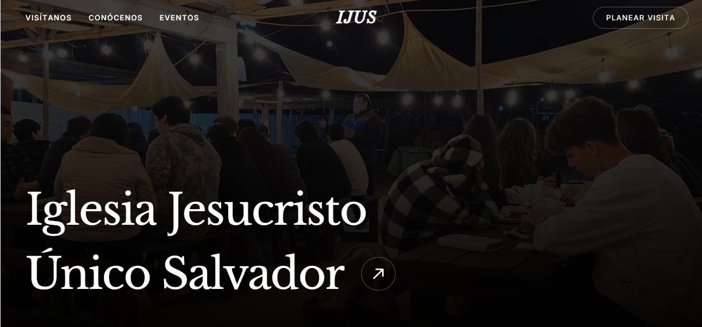

<div align="center">



</div>

# IJUS — Iglesia Jesucristo Único Salvador

Landing page and visitor management system for Iglesia IJUS (Estación Central, Santiago). A single-page application where visitors can learn about the church, browse upcoming events and news, and request contact through a "Planear Visita" form that triggers an automated welcome email.

## Overview

The site serves two audiences from one codebase:

- **Public site** — home page, events/news feed (`/novedades`), and a contact form.
- **Admin panel** — a private dashboard (`/admin`) where staff manage events and notices, backed by Supabase Auth.

When a visitor submits the contact form, the record is stored in Supabase and a database webhook invokes an Edge Function that sends a welcome email through Resend.

## Features

### Frontend

- React 19 with functional components and `react-router-dom` routing.
- Route-based code splitting (`React.lazy`) so the admin panel and Novedades page load on demand.
- Animations via `motion/react`; smooth scrolling via `lenis`.
- Tailwind CSS v4 utility-first styling with a shared brand palette.

### Backend (Supabase + Resend)

- **Authentication** — Supabase Auth guards the admin routes.
- **Database** — PostgreSQL tables for events, notices and subscribers (see schema below).
- **Edge Function** — a Deno function (`send-welcome-email`) that calls the Resend API to send the visitor welcome email, triggered by a database webhook on new subscribers.

## Tech Stack

| Layer | Technology |
|---|---|
| Framework | React 19, Vite 6 |
| Styling | Tailwind CSS v4 |
| Routing | React Router 7 |
| Animation | motion, lenis |
| Backend | Supabase (Postgres, Auth, Storage, Edge Functions) |
| Email | Resend |

## Database Schema (Supabase)

**`event`** — Church events shown on the landing page and Novedades.

| Column | Type | Notes |
|---|---|---|
| `id` | uuid | Primary key |
| `title` | text | Event name |
| `description` | text | Event details |
| `date` | timestamptz | Date & time of the event |
| `location` | text | Default: `Constantino 104, Santiago` |
| `image_url` | text | Optional cover image |

**`notice`** — News and general information posts.

| Column | Type | Notes |
|---|---|---|
| `id` | uuid | Primary key |
| `title` | text | Post title |
| `content` | text | Post body |
| `type` | text | `news` or `info` |
| `author` | text | Default: `Equipo IJUS` |
| `image_url` | text | Optional cover image |
| `published_at` | timestamptz | Publish date |

**`subscriber`** — Visitors who request contact via the "Planear Visita" form. Insert triggers the welcome-email Edge Function.

| Column | Type | Notes |
|---|---|---|
| `id` | uuid | Primary key |
| `name` | text | Optional |
| `contact_method` | text | `email` or `whatsapp` |
| `contact_value` | text | Email address or phone number |
| `subscribed_at` | timestamptz | Signup timestamp |

## Project Structure

```text
IJUS-Website/
├── visuals/                       Frontend application
│   ├── index.html
│   ├── package.json
│   ├── vite.config.ts
│   ├── public/                    Static assets (images, video, favicon)
│   └── src/
│       ├── App.tsx                Router and layout
│       ├── main.tsx               React entry point
│       ├── index.css              Tailwind theme and globals
│       ├── pages/                 Home, Novedades, AdminLogin, AdminDashboard
│       ├── components/            Reusable UI (Navbar, Hero, Footer, modals, …)
│       ├── lib/                   supabase client, data helpers, auth context
│       └── utils/                 Helpers (cn)
└── supabase/
    └── functions/
        └── send-welcome-email/    Deno Edge Function (Resend)
```

## Getting Started

### Prerequisites

- Node.js 18 or higher
- A Supabase project (URL and anon key)

### Setup

1. Clone the repository and enter the frontend workspace:

   ```bash
   git clone https://github.com/dianAnton/IJUS-Website.git
   cd IJUS-Website/visuals
   ```

2. Install dependencies:

   ```bash
   npm install
   ```

3. Create `visuals/.env.local` with your Supabase credentials:

   ```env
   VITE_SUPABASE_URL=your_supabase_project_url
   VITE_SUPABASE_ANON_KEY=your_supabase_anon_key
   ```

4. Start the development server:

   ```bash
   npm run dev
   ```

### Available Scripts

Run from the `visuals/` directory:

| Command | Description |
|---|---|
| `npm run dev` | Start the Vite development server |
| `npm run build` | Build the production bundle to `dist/` |
| `npm run preview` | Preview the production build locally |
| `npm run lint` | Type-check the project with `tsc` |

## Documentation

Additional technical documentation lives in [`docs/`](docs/):

- [Architecture](docs/arquitectura.md) — project structure, routes and data flow.
- [Design System](docs/sistema-de-diseno.md) — colors, typography, spacing and motion.

## Deployment

Build the static site with `npm run build` and deploy the `visuals/dist/` output to any static host. The Supabase Edge Function is deployed separately via the Supabase CLI.
